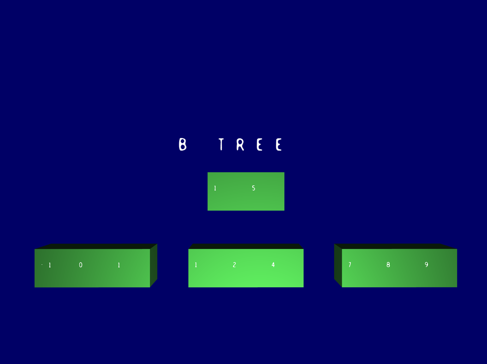

# Draw
Draw: OpenGL data structure drawing 

## Setup

While on draw/ folder

```bash
mkdir build
cd build
cmake ..
make
```

Make will produce an executables, such as `b_tree`.

## How to run

Using `b_tree` as the example executable, run it with the following command

```bash
./b_tree
```

A window should pop up with the animation. You should be able to interact by using the mouse to rotate the camera, and AWSD keys to move the camera through space. To scape the animation, press ESC. The following image is what you should expect to see:

